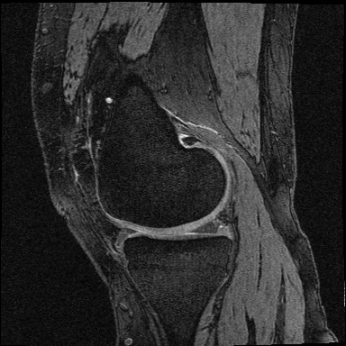
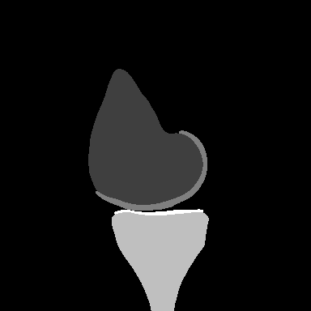

# Implementation of Unet architecture using Keras, for knee MRI semantic segmentation

The architecture was inspired by [U-Net: Convolutional Networks for Biomedical Image Segmentation](https://arxiv.org/abs/1505.04597).

---

## Data

The original dataset is from [OAI ZIB dataset ](https://nda.nih.gov/oai/). 
This archive contained manual segmentations of the OAI ZIB dataset stored as label/voxel fields saved in the 'ITK MetaImage MHD'-format.
During pre-proccess the images were converted to png format. 

## Model

The input and output of the network are 384*384 pixel images.

### Results

|

